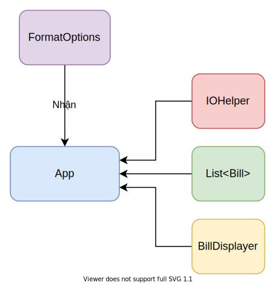
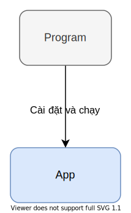

# Báo cáo: Bài test OOP

> **Đề: làm phần mềm quản lý các hóa đơn cho một cửa hàng**

## Yêu cầu:

- Nhập danh sách N hóa đơn.

- Xuất danh sách N hóa đơn đã nhập ra màn hình.

  - Chỉ hiện 1 hoá đơn mỗi lần. Bấm nút mũi tên để hiển thị qua lại các hoá đơn.

- Lưu danh sách N hóa đơn vào danh_sach_hoa_don.txt

## Các lớp chính:

### App

Là nơi chạy và thực hiện các chức năng được yêu cầu.

Để lưu trữ hóa đơn, App sử dụng một danh sách có thể chứa các đối tượng thuộc lớp `Bill`.

Để thực hiện các chức năng của mình, `App` sử dụng `IOHelper` và `BillDisplayer`.

Để format khi xuất chuỗi ra màn hình, `App` sử dụng `FormatOptions`.

### Program

Là nơi cài đặt và khởi động `App`.

Các cài đặt bao gồm:

- các đối tượng `FormatOptions` cho việc nhập hóa đơn, xuất hóa đơn.
- Tên file dùng để lưu danh sách hóa đơn.

### IOHelper

Chứa các phương thức tiện cho việc nhập/xuất dữ liệu ra màn hình.

`IOHelper` Sử dụng `FormatOptions` để format dữ liệu khi xuất.

### BillDisplayer

Dùng để xuất hóa đơn ra màn hình, nhận `IOHelper` dùng cho việc xuất.

### Các lớp chứa dữ liệu:

#### Bill

Chứa thông tin về hóa đơn:

- Mã sản phẩm.
- Ngày lập.
- Thông tin khách hàng.
- Danh sách các chi tiết hóa đơn.
- Tổng giá.

`Bill` sử dụng `Customer` để chứa thông tin khách hàng.

Để chứa chi tiết hóa đơn, `Bill` sử dụng một danh sách có thể chứa các đối tượng thuộc lớp `BillDetails`.

#### Customer

Chứa thông tin về khách hàng:

- Mã khách hàng.
- Tên khách hàng.
- Số điện thoại.
- Địa chỉ.

#### BillDetails

Chứa thông tin về chi tiết hóa đơn:

- Thông tin sản phẩm
- Số lượng sản phẩm bán ra.

`BillDetails` sử dụng `Product` để chứa thông tin sản phẩm.

#### Product

Là lớp trừu tượng, chứa thông tin chung của một sản phẩm:

- Mã sản phẩm
- Tên sản phẩm
- Kiểu sản phẩm
- Nơi sản xuất
- Đơn giá

Các lớp sản phẩm cụ thể hoặc trừu tượng thừa hưởng từ lớp này sẽ có thêm những thông tin khác.

`Product` thực thi interface `IStringConvertable` dùng cho việc lấy các dữ liệu trong một đối tượng ra dạng chuỗi.

#### Fan

Là lớp trừu tượng, chứa thông tin chung về sản phẩm quạt.

Các lớp cụ thể thừa hưởng lớp này:

- `FanStand`
- `FanMist`
- `FanRechargable`

#### AirConditioner

Là lớp trừu tượng, chứa thông tin chung về sản phẩm quạt.
Các lớp cụ thể thừa hưởng lớp này:

- `AirConditionerOneWay`
- `AirConditionerTwoWay`

### Các lớp/interface khác:

#### IStringConvertable

Yêu cầu các phương thức liên quan đến lấy dữ liệu trong lớp ra dạng chuỗi.

#### ProductFactory

Là lớp trừu tượng, dùng để tạo ra loại sản phẩm được yêu cầu.
`ProductFactory` nhận `IOHelper` và dùng nó để tạo sản phẩm.

Các lớp cụ thể thừa hưởng lớp này:

- `FanFactory`
- `AirConditionerFactory`

## Cách thức hoạt động

### Menu lựa chọn:

Khi chạy chương trình, Program cài đặt và khởi động `App`, sau đó `App` sẽ đưa ra màn hình menu lựa chọn.

Người dùng nhập vào lựa chọn của mình để `App` thực hiện tính năng mong muốn.

Sau khi thực hiện một tính năng, người dùng có thể bấm `ESC` để quay lại menu này

### Nhập danh sách hóa đơn:

`App` sử dụng `IOHelper` để xuất các yêu cầu đến người dùng, nhận vào các dữ liệu từ người dùng (số hóa đơn cần nhập, thông tin về hóa đơn, khách hàng, ...).

Tùy vào loại sản phẩm mà người dùng muốn, một đối tượng thuộc lớp `ProductFactory` sẽ được tạo ra để tạo sản mong muốn.

Tất cả các thông tin của hóa đơn sẽ được cho vào đối tượng thuộc lớp `Bill`.

Lưu đối tượng đó vào danh sách. Nếu vẫn còn hóa đơn cần được nhập thì tiếp tục quá trình nhập hóa đơn.

### Xuất danh sách hóa đơn:

`App` kiểm tra xem có hóa đơn để xuất hay không, nếu không thì hiện thông báo không có hóa đơn lên màn hình.

Nếu có, `App` sử dụng `BillDisplayer` để xuất thông tin danh sách hóa đơn.

`BillDisplayer` hiện mỗi lần một hóa đơn, người dùng bấm mũi tên trái phải để xem các hóa dơn khác.

`BillDisplayer` xuất thông tin của sản phẩm bằng cách sử dụng phương thức được đảm bảo bởi `IStringConvertable`.

### Lưu danh sách hóa đơn vào file:

`App` kiểm tra xem có hóa đơn để xuất hay không, nếu không thì hiện thông báo không có hóa đơn lên màn hình.

Nếu có, `App` sẽ tạo file (mặc định là "danh_sach_hoa_don.txt") và lưu tại thư mục chứa chương trình (BillManager.exe).

Người dùng sẽ được quyền đổi tên file và địa điểm lưu file.

`App` sau đó thông báo cho người dùng danh sách hóa đơn đã lưu thành công và địa điểm lưu.

`App` lưu thông tin của sản phẩm bằng cách sử dụng phương thức được đảm bảo bởi `IStringConvertable`.

