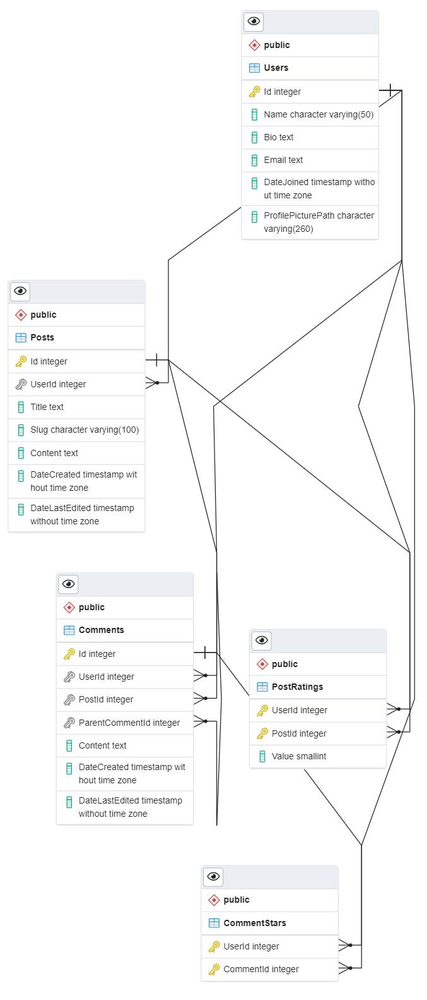
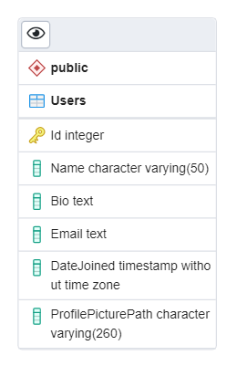
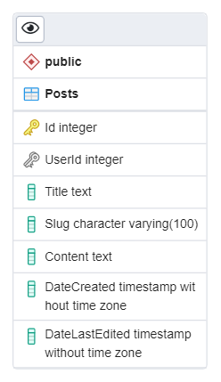
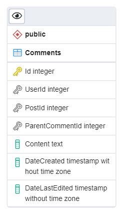
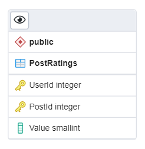
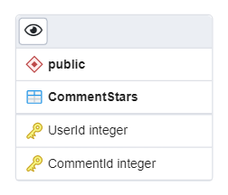

# Phân tích Task #2: Tạo bài viết chia sẻ

Trang cho phép người dùng đăng bài viết chia sẻ, xem bài viết của người khác, bình luận và đánh giá bài viết.

## Các tính năng chính:

Những tính năng quan trọng để trang có thể hoạt động.

### Người dùng chưa đăng nhập:

- Có thể xem bài viết.
- Tìm kiếm và lọc bài viết.
- Xem bình luận của bài viết.

### Người dùng đã đăng nhập:

- Những tính năng mà [người dùng chưa đăng nhập](#người-dùng-chưa-đăng-nhập) có thể làm.
- Có thể sửa thông tin cá nhân.
- Có thể tạo bài viết.
- Có thể bình luận (bình luận bài viết hoặc trả lời một bình luận nào đó).
- Có thể đánh giá sao bài viết.
- Có thả sao bình luận.

### Chủ bài viết:

> Chủ bài viết là một [người dùng đã đăng nhập](#người-dùng-đã-đăng-nhập) và là chủ của bài viết nào đó.

- Có thể sửa bài viết của mình.
- Có thể xóa bài viết của mình.

### Chủ bình luận

> Chủ bình luận là một [người dùng đã đăng nhập](#người-dùng-đã-đăng-nhập) và là chủ của bình luận nào đó.

- Có thể sửa bình luận của mình.
- Có thể xóa bình luận của mình.

### Admin

> Admin là một [người dùng đã đăng nhập](#người-dùng-đã-đăng-nhập), có quyền hạn cao hơn để quản lí trang.

- Những tính năng mà [người dùng đã đăng nhập](#người-dùng-đã-đăng-nhập) có thể làm.
- Có thể sửa bài viết của người dùng bất kỳ.
- Có thể xóa bài viết của người dùng bất kỳ.
- Có thể tạo bài viết cho người dùng bất kỳ.
- Có thể xóa bình luận của người dùng bất kỳ.

## Các trang chính và các yêu cầu cho các trang:

Yêu cầu mặc định sẽ cho phép tất cả người dùng sử dụng tính năng trừ khi được ghi rõ ra các trường hợp khác.

### Trang nhà của người dùng:

Hiện thông tin cơ bản của người dùng, thông số và các bài viết đã đăng của người dùng đó.

Người dùng mà trang nhà đang hiện thông tin được gọi là chủ nhà.

#### Yêu cầu:

1. Chỉ [người dùng đã đăng nhập](#người-dùng-đã-đăng-nhập) mới có trang nhà của riêng mình.
1. Hiện tên, mô tả, ảnh đại diện, ngày gia nhập của chủ nhà, số bài đã đăng, số bình luận, số bài đã đánh giá, trung bình sao bài viết của chủ nhà.
1. Tính năng [tìm kiếm bài viết](#tìm-kiếm-bài-viết), nhưng chỉ cho tìm những bài viết của chủ nhà.
1. Tính năng [sửa thông tin cá nhân](#sửa-thông-tin-cá-nhân).
1. Với mỗi bài viết, nếu người dùng là chủ nhà và đã đăng nhập hoặc người dùng là [Admin](#admin):
   1. Hiện nút xóa bài, khi bấm vào sẽ [xóa bài viết](#xóa-bài-viết) này.
   1. Hiện nút sửa bài, khi bấm vào sẽ đi đến [trang sửa bài viết](#trang-sửa-bài-viết) của bài viết này.
1. Với mỗi bài viết khi bấm vào tiêu đề bài viết thì đi đến [trang xem bài viết](#trang-xem-bài-viết).
1. Nếu người dùng là chủ nhà, hiện nút tạo bài viết, khi bấm vào sẽ đi đến [trang tạo bài viết](#trang-tạo-bài-viết).

### Trang xem bài viết:

Hiện nội dung và thông tin về bài viết cần xem, các bình luận của bài viết.

#### Yêu cầu:

1. Tính năng [xem bài viết](#xem-bài-viết).
1. Tính nắng [xem bình luận](#xem-bình-luận).
1. Tính nắng [xem số lượng sao của bình luận](#xem-số-lượng-sao-của-bình-luận).
1. Nếu người dùng là [người dùng đã đăng nhập](#người-dùng-đã-đăng-nhập):
   1. Cho phép [đánh giá sao bài viết](#đánh-giá-sao-bài-viết).
   1. Cho phép [thả sao bình luận](#thả-sao-bình-luận).
   1. Cho phép [bình luận](#bình-luận).
1. Nếu người dùng là [chủ bài viết](#chủ-bài-viết) hoặc là [Admin](#admin):
   1. Các yêu cầu 5.i, 5.ii của [trang nhà của người dùng](#trang-nhà-của-người-dùng).
1. Nếu người dùng bấm vào ảnh đại diện hoặc tên [chủ bài viết](#chủ-bài-viết) thì sẽ đi đến [trang nhà của chủ bài viết](#trang-nhà-của-người-dùng) đó.
1. Với mỗi bình luận, Nếu người dùng bấm vào ảnh đại diện hoặc tên [chủ bình luận](#chủ-bình-luận) thì sẽ đi đến [trang nhà của chủ bình luận](#trang-nhà-của-người-dùng) đó.
1. Với mỗi bình luận, Nếu người dùng là [chủ bình luận](#chủ-bình-luận):

   1. Hiện nút sửa bình luận, khi bấm vào sẽ cho phép [sửa bình luận](#sửa-bình-luận).
   1. Hiện nút xóa bình luận, khi bấm vào sẽ cho phép [xóa bình luận](#xóa-bình-luận).

1. Với mỗi bình luận, Nếu người dùng là [Admin](#admin):
   1. Yêu cầu 10.ii.

### Trang khám phá:

Hiện danh sách các bài viết của nhiều người dùng khác nhau.

#### Yêu cầu:

1. Tính năng [tìm kiếm bài viết](#tìm-kiếm-bài-viết).
1. Yêu cầu 6 của [trang nhà của người dùng](#trang-nhà-của-người-dùng).
1. Với mỗi bài viết, Yêu cầu 6 của [trang xem bài viết](#trang-xem-bài-viết).
1. Có nút tạo bài viết, khi bấm vào:
   1. Nếu là [người dùng đã đăng nhập](#người-dùng-đã-đăng-nhập): đi đến [trang tạo bài viết](#trang-tạo-bài-viết).
   1. Nếu là [người dùng chưa đăng nhập](#người-dùng-chưa-đăng-nhập): đi đến trang đăng nhập.

### Trang tạo bài viết:

#### Yêu cầu:

1. Chỉ [người dùng đã đăng nhập](#người-dùng-đã-đăng-nhập) mới vào được trang tạo bài viết.
1. Tính năng [tạo bài viết](#tạo-bài-viết).
1. Nút hủy, khi bấm vào sẽ hủy bỏ việc tạo bài viết và quay lại trang trước.

### Trang sửa bài viết:

#### Yêu cầu:

1. Chỉ [Admin](#admin) hoặc [chủ bài viết](#chủ-bài-viết) mới vào được trang sửa bài viết.
1. Tính năng [sửa bài viết](#sửa-bài-viết).
1. Nút hủy, khi bấm vào sẽ hủy bỏ việc sửa bài viết và quay lại trang trước.

## Yêu cầu chi tiết cho từng tính năng:

### Xem bài viết:

1. Bài viết được hiển thị đúng như những gì [chủ bài viết](#chủ-bài-viết) ghi ra.
1. Thấy được tên [chủ bài viết](#chủ-bài-viết), ngày đăng, đánh giá sao của bài viết.

### Xem bình luận:

1. Thấy được các bình luận.
1. Chỉ hiển thị các bình luận bài viết. Nếu muốn, người dùng có thể yêu cầu xem các trả lời bình luận của một bình luận bài viết nào đó (nếu có).
1. Chỉ hiện thị một lần tối đa 20 bình luận bài viết, hiển thị thêm nếu người dùng yêu cầu.
1. Chỉ hiện thị một lần tối đa 10 trả lời bình luận, hiển thị thêm nếu người dùng yêu cầu.
1. Chỉ hiện thị trả lời bình luận của một trả lời bình luận nào đó nếu người dùng yêu cầu.
1. Nếu bình luận đã bị sửa, cho người dùng biết ở trên bình luận.

### Tìm kiếm bài viết:

1. Ban đầu, hiện danh sách các bài viết theo ngày đăng mới nhất giảm dần.
1. Cho phép tìm các bài viết liên quan thông qua các cụm từ mà người dùng đưa vào.
1. Cho phép tìm kiếm theo ngày đăng.
1. Cho phép tìm kiếm theo ngày chỉnh sửa.
1. Cho phép tìm kiếm theo tên người dùng.
1. Cho phép tìm kiếm theo đánh giá sao.
1. Chỉ hiển thị bài viết ở dạng tiêu đề, người viết, ngày đăng, đánh giá sao. Không hiển thị nội dung bài viết.
1. Phân thành nhiều trang nếu có nhiều bài viết để hiện, một trang chỉ hiển thị một lần tối đa 15 bài viết.
1. Nếu kết quả tìm kiếm không có, thông báo cho người dùng biết.

### Sửa thông tin cá nhân:

1. Nếu người dùng là [người dùng chưa đăng nhập](#người-dùng-chưa-đăng-nhập): không cho phép sửa thông tin cá nhân.
1. Nếu người dùng là [người dùng đã đăng nhập](#người-dùng-đã-đăng-nhập): chỉ cho phép sửa thông tin cá nhân của chính người dùng đó.
1. Cho phép sửa tên người dùng, mô tả.
1. Cho phép tải lên ảnh đại diện mới.
1. Không cho phép áp dụng chỉnh sửa nếu tên người dùng sau chỉnh sửa đã tồn tại.

### Tạo bài viết:

1. Nếu người dùng là [người dùng chưa đăng nhập](#người-dùng-chưa-đăng-nhập): không cho phép tạo bài viết.
1. Nếu người dùng là [người dùng đã đăng nhập](#người-dùng-đã-đăng-nhập): cho phép tạo bài viết với [chủ bài viết](#chủ-bài-viết) là chính người dùng đó.
1. Nếu người dùng là [Admin](#admin): cho phép đặt [chủ bài viết](#chủ-bài-viết) là người dùng bất kỳ.
1. Cho phép viết tiêu đề bài viết.
1. Cho phép viết nội dung bài viết, làm đep nội dung bài viết (in đậm, in hoa, danh sách, ...), gắng hình ảnh, link trong nội dung bài viết.
1. Không cho phép đăng bài nếu người dùng chưa đặt tiêu đề bài viết hoặc nội dung bài viết để trống.

### Sửa bài viết:

1. Nếu người dùng không phải là [chủ bài viết](#chủ-bài-viết): không cho phép sửa bài viết.
1. Nếu người dùng là [chủ bài viết](#chủ-bài-viết): cho phép sửa bài viết, không cho phép đổi [chủ bài viết](#chủ-bài-viết).
1. Nếu người dùng là [Admin](#admin): cho phép sửa bài viết của người dùng bất kỳ, cho phép đổi [chủ bài viết](#chủ-bài-viết).
1. Các yêu cầu 4, 5 của tính năng [tạo bài viết](#tạo-bài-viết).
1. Tiêu đề và nội dung bài viết cần sửa được ghi sẵn lên các trường tương ứng.
1. Không cho phép áp dụng chỉnh sửa nếu người dùng chưa đặt tiêu đề bài viết hoặc nội dung bài viết để trống.

### Xóa bài viết:

1. Nếu người dùng không phải là [chủ bài viết](#chủ-bài-viết): không cho phép xóa bài viết.
1. Nếu người dùng là [chủ bài viết](#chủ-bài-viết): chỉ cho phép xóa bài viết của chính người dùng đó.
1. Nếu người dùng là [Admin](#admin): cho phép xóa bài viết của người dùng bất kỳ.
1. Trước khi xóa bài viết, cần yêu cầu người dùng xác nhận lại quyết định của mình.

### Bình luận:

1. Nếu người dùng là [người dùng chưa đăng nhập](#người-dùng-chưa-đăng-nhập): không cho phép bình luận.
1. Nếu người dùng là [người dùng đã đăng nhập](#người-dùng-đã-đăng-nhập): cho phép bình luận.
1. Không cho phép đăng bình luận nếu nội dung bình luận trống.

### Sửa bình luận:

1. Nếu người dùng không là [chủ bình luận](#chủ-bình-luận) hoặc chưa đăng nhập: không cho phép sửa bình luận.
1. Nếu người dùng là [chủ bình luận](#chủ-bình-luận): cho phép sửa bình luận.
1. Không cho phép sửa bình luận nếu nội dung bình luận trống.

### Xóa bình luận:

1. Nếu người dùng không phải là [chủ bình luận](#chủ-bình-luận) hoặc chưa đăng nhập: không cho phép xóa bình luận.
1. Nếu người dùng là [chủ bình luận](#chủ-bình-luận): chỉ cho phép xóa bình luận của chính người dùng đó.
1. Nếu người dùng là [Admin](#admin): cho phép xóa bình luận của người dùng bất kỳ.
1. Trước khi xóa bài viết, cần yêu cầu người dùng xác nhận lại quyết định của mình.

### Đánh giá sao bài viết:

> Khi một người dùng muốn bày tỏ rằng một bài viết chia sẻ nào đó là hữu ích, đúng hay đồng cảm nghĩ, ... Thì người dùng đó có thể đánh giá sao lên bài viết đó đó.

1. Nếu người dùng là [người dùng chưa đăng nhập](#người-dùng-chưa-đăng-nhập): không cho phép đánh giá sao bài viết.

1. Nếu người dùng là [người dùng đã đăng nhập](#người-dùng-đã-đăng-nhập): cho phép đánh giá sao bài viết.

1. Chỉ được đánh giá sao theo thang điểm số nguyên từ 1 - 5 sao.

1. Chỉ cho phép đánh giá sao một lần cho một bài viết.

1. Người dùng có thể đổi ý và bỏ đánh giá sao của mình cho một bài viết nào đó

### Thả sao bình luận:

> Tương tự như tính năng like trên facebook, nhưng thay vì like thì là ngôi sao.
>
> Khi một người dùng muốn bày tỏ rằng một bình luận nào đó là hữu ích, đúng hay đồng cảm nghĩ, ... Thì người dùng đó có thể thả sao lên bình luận đó.

1. Nếu người dùng là [người dùng chưa đăng nhập](#người-dùng-chưa-đăng-nhập): không cho phép thả sao.

1. Nếu người dùng là [người dùng đã đăng nhập](#người-dùng-đã-đăng-nhập): cho phép thả sao.

1. Chỉ cho phép thả 1 sao cho một bình luận.

1. Người dùng có thể đổi ý và bỏ thả sao của mình cho một bình luận nào đó.

### Xem số lượng sao của bình luận:

1. Số lượng người thả sao vào một bình luận sẽ được đếm và hiện lên trên bình luận.

1. Nếu số lượng người thả sao là 0: không hiện số lượng người thả sao lên trên bình luận đó.

## Cơ sở dữ liệu

### Bảng Users:

Bảng chứa các cột `người dùng`:

Cột `Người dùng`: Chứa các thông tin cá nhân cơ bản liên quan đến người dùng.

Khóa chính: Id

#### Các thuộc tính

- Id: mã `người dùng`.
- Name: tên hiển thị của người dùng.
- Bio: mô tả về người dùng.
- Email: địa chỉ email của người dùng.
- DateJoined: Ngày tạo tài khoản.
- ProfilePicturePath: đường dẫn đến file ảnh đại diện người dùng.

### Bảng Posts

Bảng chứa các cột `bài viết`:

Cột `bài viết`: Chứa nội dung bài viết và các thông tin liên quan đến bài viết chia sẻ đó.

Khóa chính: Id
Khóa ngoại: UserId

#### Các thuộc tính

- Id: mã `bài viết`.
- UserId: mã `người dùng` ([chủ bài viết](#chủ-bài-viết)).
- Title: Tiêu đề bài viết.
- Slug: tên dùng để tạo thành url đi đến bài viết.
- Content: nội dung bài viết.
- DateCreated: ngày tạo bài viết.
- DateLastEdited: ngày sửa bài viết mới nhất.

Một `bài viết` chỉ có một `người dùng` là [chủ bài viết](#chủ-bài-viết).

Một `người dùng` có thể đăng nhiều `bài viết`.

### Bảng Comments

Bảng chứa các cột `bình luận`

Cột `bình luận`: Chứa nội dung bình luận và các thông tin liên quan đến bình luận đó.

Khóa chính: Id
Khóa ngoại: UserId, PostId, ParentCommentId

#### Các thuộc tính

- Id: mã `bình luận`.
- UserId: mã `người dùng` ([chủ bình luận](#chủ-bình-luận)).
- PostId: mã `bài viết`.
- ParentCommentId: mã `bình luận` nếu bình luận này trả lời cho một bình luận nào đó.
- Content: nội dung bình luận.
- DateCreated: ngày tạo bình luận.
- DateLastEdited: ngày sửa bình luận mới nhất.

Một `bình luận`:

- chỉ có một người `người dùng` là [chủ bình luận](#chủ-bình-luận).
- chỉ thuộc một `bài viết`.
- có thể nằm trong một `bình luận` khác (trả lời một `bình luận` nào đó).

Một `người dùng` có thể viết nhiều `bình luận`.

Một `bài viết` có thể có nhiều `bình luận`.

### Bảng PostRatings

Bảng chứa các cột `đánh giá sao bài viết`.

Cột `đánh giá sao bài viết`: chứa đánh giá sao của `người dùng` cho một `bài viết` nào đó.

Khóa chính: (UserId, PostId)
Khóa ngoại: UserId, PostId

#### Các thuộc tính

- UserId: mã `người dùng` (người đánh giá sao bài viết).
- PostId: mã `bài viết`.
- Value: số lượng sao của đánh giá.

Một `đánh giá sao bài viết`:

- Chỉ là đánh giá sao của một `bài viết`.
- Chỉ có một `người dùng` là người đánh giá sao.

Một `người dùng` có thể là người đánh giá sao của nhiều `đánh giá sao bài viết`.

Một `bài viết` có thể có nhiều `đánh giá sao bài viết`.

### Bảng CommentStars

Bảng chứa các cột `sao bình luận`.

Cột `sao bình luận`: chứa sao của `người dùng` cho một `bình luận` nào đó.

Khóa chính: (UserId, CommentId)
Khóa ngoại: UserId, CommentId

#### Các thuộc tính

- UserId: mã `người dùng` (người thả sao bình luận).
- CommentId: mã `bình luận`.

Một `sao bình luận`:

- Chỉ là sao của một bình `bình luận`.
- Chỉ có một `người dùng` là người thả sao.

Một `người dùng` có thể là người thả sao của nhiều `sao bình luận`.

Một `bình luận` có thể có nhiều `sao bình luận`.
